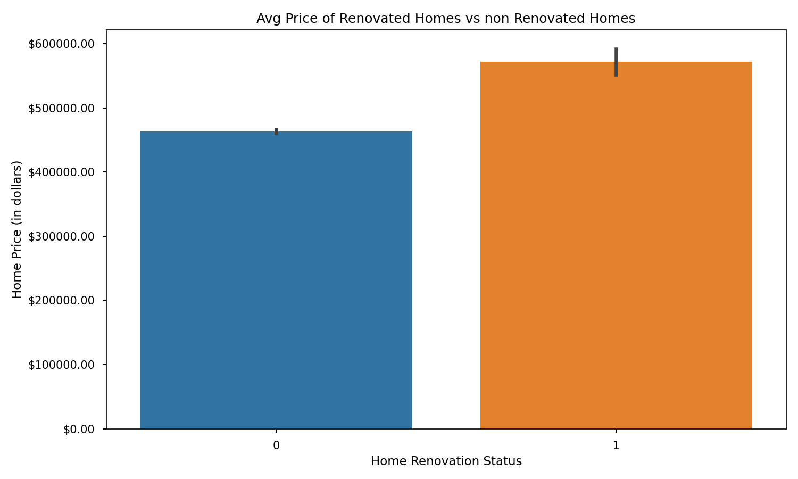
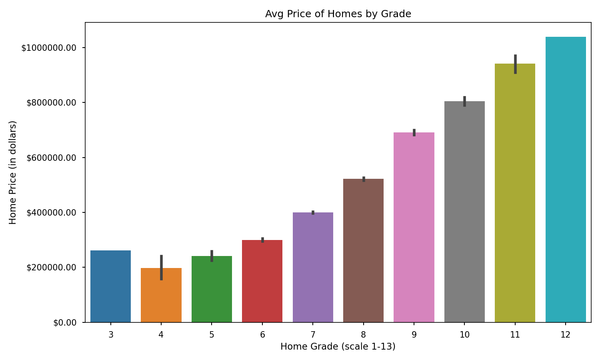
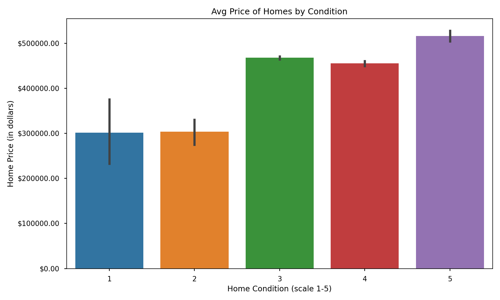

# King County Housing Analysis

**Authors**: Peder Norr

## Overview

This proposal contains an analysis of house sales data in King County in order to provide King County home owners with necessary information as they prepare to renovate and sell their homes. Specifically, it provides actionable insights with respect to what kind of home renovations the home owners might make with the goal of maximizing the sale price of their home. Initial analysis of home sale price and other housing data shows that home sale prices are most positively related to the renovation status (ie if the home was renovated at all), grade, and condition of the home. Home owners can use this analysis to choose which renovations to make as they seek to achieve the highest sale price possible for their home.


## Business Problem

As the housing market in their area continues to run hot, there are many King County residents that have decided to sell their homes and want to renovate their home to increase its resale value. However, the home owners don't know what factors are important for determining a home's value and require information to inform them on what renovations to make. Using home sale price and other housing data from King County, I identify which potential renovations would best maximize home sale price.


## Data

This analysis leverages the [King County House Sales Dataset](https://www.kaggle.com/harlfoxem/housesalesprediction) which contains data on home sales from King County, Washington from the years 2014-2015. The data represents a multitude of home characteristics including square footage, number of floors, number of bedrooms, home grade and condition, and various other variables. The target variable of the analysis is home price. My final cleaned dataset consisted of 20180 homes sold from the years 2014-2015.


## Methods

In this analysis, I create and iterate through several multiple linear regression models with the goal of creating a model capable of being a useful tool to help predict housing prices and identify house characteristics that most impact price. I improved my model's iterations by removing outliers from the data, encoding zipcode as a categorical variable, and removing features with insignificant p-values. This was done in an attempt to increase the adjusted R squared value of the model and to better meet the assumptions of linearity, including normality and homoskedasticity.


## Results

The multiple linear regression analysis rendered three key insights:

### Renovated homes sell for a higher price on average



### The higher the grade, the higher the price on average



### Homes in better condition sell for a higher price on average




## Conclusions

Based on this multiple linear regression analysis, I would provides three recommendations for King County home owners looking to renovate and sell their homes, with the goal of maximizing their home sale price:

- **Any renovation is better than none.** As evidenced by a positive coefficient of 32,199.82, simply the fact that a home was renovated at all, in any capacity, could result in an increase in home price of over $30,000. Based on those results, I would recommend that homeowners conduct some kind of renovation, no matter how small.

- **Grade is king.** With a positive coefficient of 42,070.53, increasing the grade of a home by one level on a scale from 1-13 could result in an increase in home price of over $40,000. Grade is defined by King County as an overall grade given to the housing unit based on King County grading system from 1 to 13, where 1-3 falls short of building construction and design, 7 has an average level of construction and design, and 11-13 have a high quality level of construction and design. If a homeowner can improve the grade level of their home, whether by improving the construction or design of the home, it could pay large dividends.

- **Condition is last, but not least.** Represented by a positive coefficient of 22,825.45, increasing the condition of a home by one level on a scale from 1-5, could result in an increase in home price of over $20,000. Condition is defined by King County as an index from 1 to 5 based on the overall condition of the home. Homeowners should focus on improving the condition of the home, potentially by replacing appliances or other run down features of the home.

## For More Information

Please review my full analysis in [my Jupyter Notebook](./kc_housing_analysis.ipynb) or my [presentation](./kc_housing_analysis_deck.pdf).

For any additional questions, please contact Peder Norr at <norr.peder@gmail.com>

## Repository Structure

```
├── README.md                           <- The top-level README for reviewers of this project
├── kc_housing_analysis.ipynb   <- Narrative documentation of analysis in Jupyter notebook
├── kc_housing_analysis_deck.pdf         <- PDF version of project presentation
├── data                                <- Both sourced externally and generated from code
└── images                              <- Both sourced externally and generated from code
```